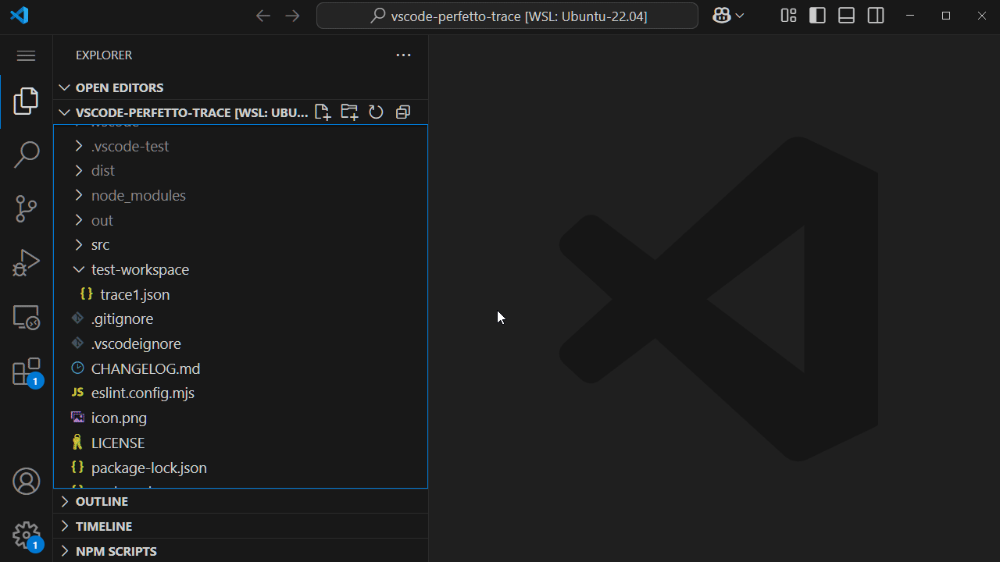

# Unofficial Perfetto UI Extension for Visual Studio Code

A VS Code extension that adds the ability to open and view perfetto-compatible trace files within VS Code.

## Features

Contributes following features to open a trace file in [perfetto ui](https://ui.perfetto.dev/) within VS Code.
- Command: `Open Trace For Active Editor`
  - Opens a new perfetto ui tab & loads active text editor content.
- Command: `Open Trace For File`
  - Opens pop up to select file to open & loads it in a new perfetto ui tab.
- Explorer context menu item: `Open Trace For File`
  - Equivalent to `Open Trace For File` command but skips file selection steps.

Additionally keeps a history of recently opened files and workspaces for quick access.

The primary motivation is to automate the following remote profiling workflow:
- generate trace file on remote
- copy trace file to local (scp or manual copy to local editor & save)
- open [perfetto ui](https://ui.perfetto.dev/) in browser
- open local trace file

## Feature Proposals

Following features are planned for a future release, although not a priority...
- Bundle perfetto ui with the extension for local environments with no or restricted internet access.
- Add extension support in web instances (e.g., https://vscode.dev/).
- Option to open perfetto ui in browser as an alternate to embedded within vscode.

Please open an issue if any of these (or something new...) would improve your experience.

See [CHANGELOG](CHANGELOG.md) for current features.

## Credits

Project icon from [google/perfetto project](https://github.com/google/perfetto)\
Copyright (c) 2017, The Android Open Source Project\
Licensed under the Apache License, Version 2.0, January 2004\
https://github.com/google/perfetto/blob/main/LICENSE

## License

This project is licensed under the MIT License and includes third-party components - see the [LICENSE](LICENSE) file for details.
